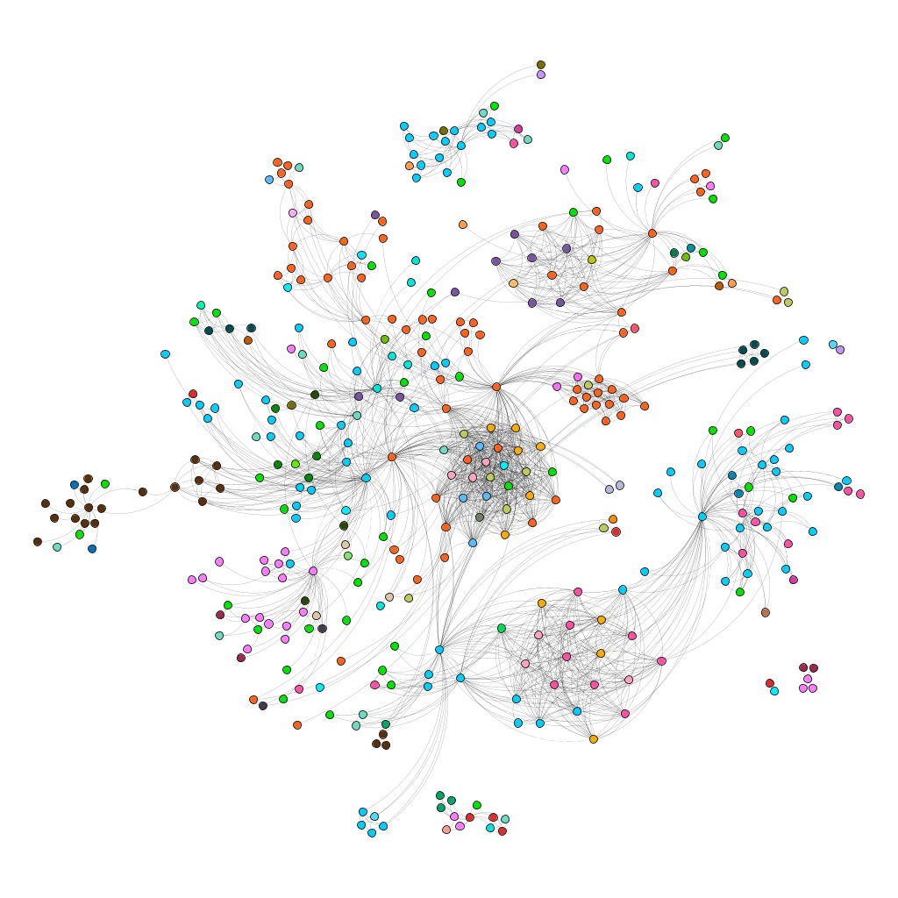
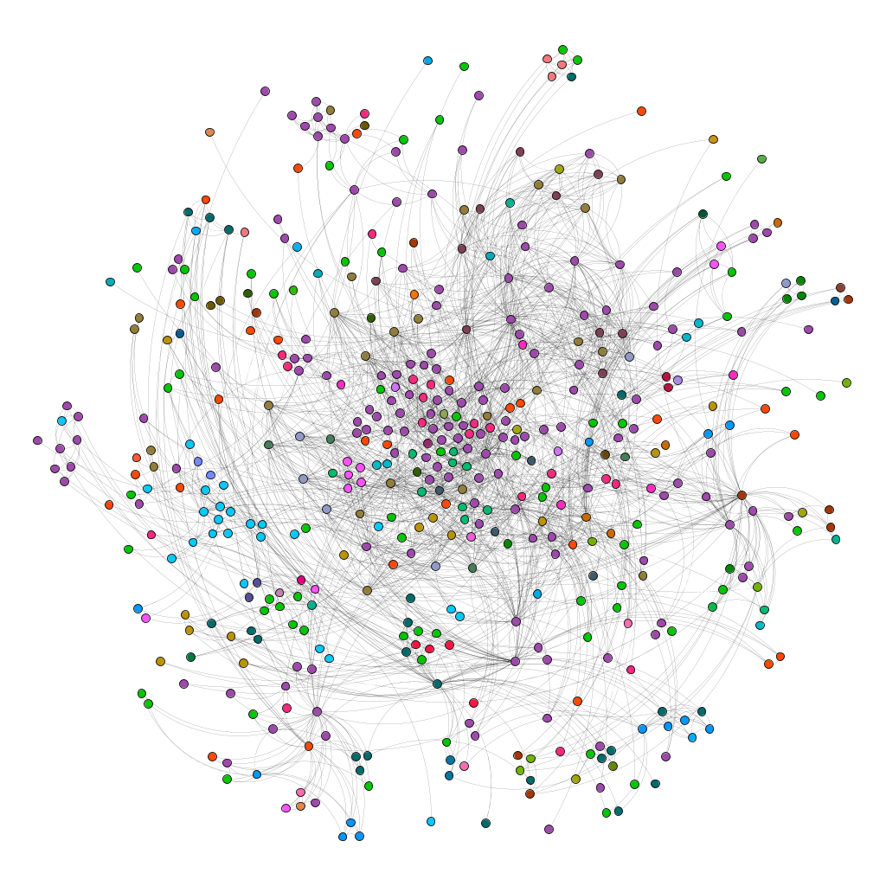
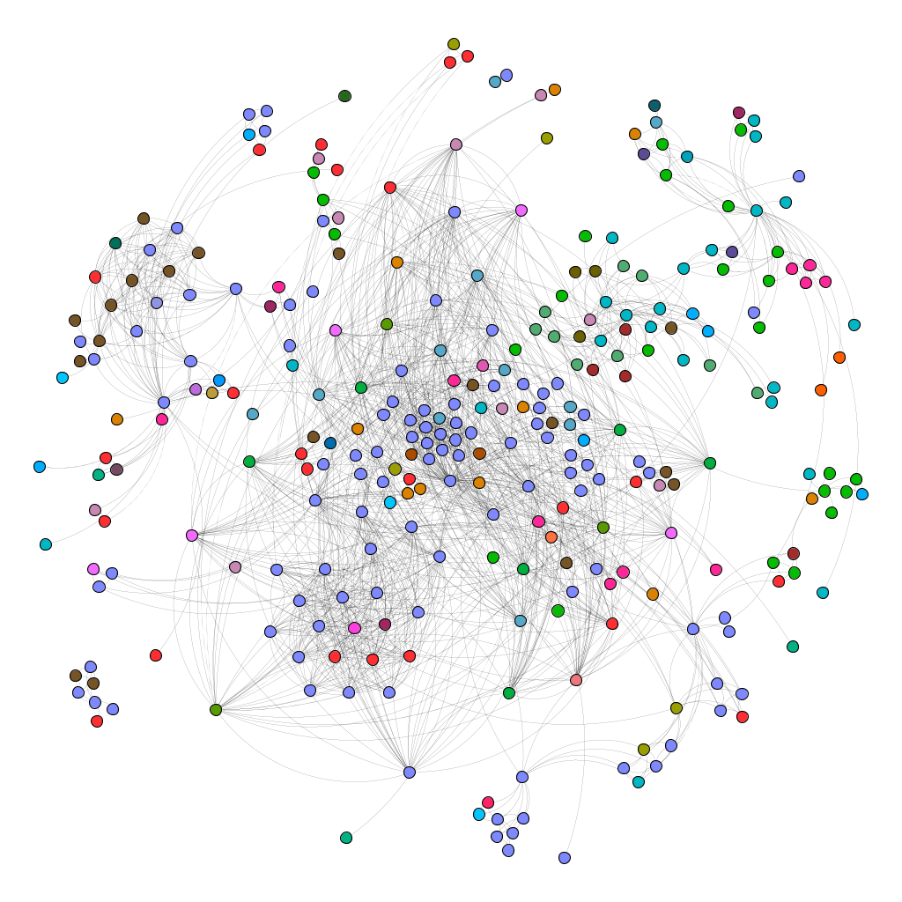

# A Comparative Analysis of Interdisciplinary Co-Authorship Networks 

We investigate co-authorship patterns among the academic research communities of three master’s programs at the University of Bologna. The goal is to analyze the topological structure of each program by examining the collaborative research activities of their faculty members. The study focuses on the master’s programs in Digital Humanities & Digital Knowledge, Computer Science, and Italian Studies, aiming to uncover insights into the interdisciplinary connections and the dynamics of scholarly collaboration within and across these programs.

|  |  |  |
|:-:|:-:|:-:|
| Digital Humanities & Digital Knowledge | Computer Science | Italian Studies |
